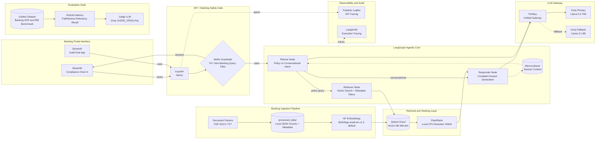

# Banking Knowledge Intelligence Platform (BKIP): Architecture Specification

## Deployment Assumptions

- **Local-first, dev-only v1**: FastAPI and Streamlit run on localhost; no authentication or production hardening in early phases.
- **Embedding default**: `BAAI/bge-small-en-v1.5` (384-dim). Override with `EMBEDDING_MODEL` for alternatives such as `sentence-transformers/all-MiniLM-L6-v2`.
- **Vector dimensions**: Collection size must match the active embedding model (384-dim for BGE-small and MiniLM).



> **Eval UI note**: The Audit Eval App ships in Phase 6 but calls the same `POST /query` endpoint built in Phase 2.

## Ingestion Data Flow

```
DATA/ (raw PDF, DOCX, TXT)
  → Document Parsers (loaders/)
  → Semantic Chunking (chunking/)
  → processed_data/{doc_id}.json  (chunks + metadata persisted locally)
  → Embedding (BGE default)
  → Qdrant Cloud (vectors + metadata payload)
```

Re-embedding can skip parsing by reading from `processed_data/` when source files are unchanged.

## API Contract

### `GET /health`

| Field | Type | Description |
|---|---|---|
| `status` | string | `"ok"` when service is running |
| `qdrant` | string | Optional; `"connected"` / `"unavailable"` (Phase 2+) |

### `POST /query`

**Request**

| Field | Type | Required | Description |
|---|---|---|---|
| `message` | string | yes | User question or message |
| `thread_id` | string | yes | Conversation thread for MemorySaver |
| `filters` | object | no | Metadata filters for retrieval |
| `filters.category` | string | no | Document category (e.g. `RBI`, `SOP`, `KYC`) |
| `filters.file_name` | string | no | Restrict to a specific source file |

**Response (allowed)**

| Field | Type | Description |
|---|---|---|
| `answer` | string | Generated compliant answer |
| `sources` | array | Retrieved chunks with `file_name`, `chunk_index`, `score`, `text` |
| `thought_process` | array | Agent reasoning steps |
| `blocked` | boolean | `false` |

**Response (blocked by guardrails)**

| Field | Type | Description |
|---|---|---|
| `blocked` | boolean | `true` |
| `reason` | string | Block category (e.g. `off_topic`, `jailbreak`, `pii`) |
| `answer` | string | Polite refusal message |

## AgentState Schema

LangGraph state (`app/agents/state.py`):

| Field | Type | Description |
|---|---|---|
| `messages` | list | Conversation message history |
| `query` | string | Current user query |
| `documents` | list | Retrieved document chunks |
| `intent` | string | `CONVERSATIONAL` or `BANKING_POLICY_QUERY` |
| `thought_process` | list | Step-by-step agent logs |
| `thread_id` | string | Session identifier for MemorySaver |

## Retriever Metadata Filters

Applied at Qdrant query time when provided in the `/query` request:

| Filter | Type | Description |
|---|---|---|
| `category` | string | Match document category tag from ingestion |
| `file_name` | string | Match exact source filename |
| `date_added` | date range | Optional future filter on ingestion timestamp |

Filters combine with vector similarity search (pre-reranker top-K=15, post-reranker top-5).

## LLM Gateway (Phase 5+)

| Role | Model | Key |
|---|---|---|
| Primary (Planner, Responder) | `llama-3.3-70b-versatile` | `GROQ_API_KEY` via Portkey |
| Fallback | `llama-3.1-8b-instant` | `GROQ_FALLBACK_API_KEY` via Portkey |
| Guardrail gate (Phase 4) | `llama-3.1-8b-instant` | Direct or Portkey |
| RAGAS Judge (Phase 6) | Configurable Groq model | `JUDGE_GROQ_API_KEY` |

Phase 2 uses direct Groq via `app/gateway/llm_client.py` before Portkey is wired in Phase 5.
