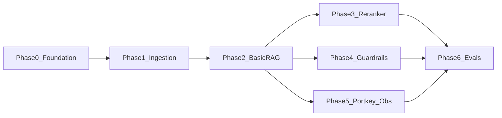

# Implementation Plan: Banking Knowledge Intelligence Platform (BKIP)

This document is the step-by-step development roadmap for BKIP. Follow phases in order; Phases 4 and 5 can run in parallel after Phase 2 is stable.

## Prerequisites

- Python 3.11+
- Qdrant Cloud account and cluster
- Groq API key (for Planner/Responder LLM calls)
- Optional (later phases): Portkey, LangSmith, Logfire, NeMo Guardrails, Judge Groq key

## Phase Dependencies



Phases 4 and 5 both depend on Phase 2 only and may be built in parallel. Phase 6 should run after Phase 3 (reranker baseline) and ideally after Phases 4 and 5 for final scores.

## Project Structure

```
AdvRAG/
├── app/
│   ├── main.py                    # FastAPI entrypoint (Phase 0 stub, Phase 2 /query)
│   ├── core/
│   │   ├── config.py              # pydantic-settings loader (Phase 0)
│   │   └── logging.py             # structured logging (Phase 0)
│   ├── gateway/
│   │   └── llm_client.py          # LLM abstraction; direct Groq → Portkey (Phase 2/5)
│   ├── guardrails/
│   │   ├── rails.py               # guard() wrapper (Phase 2 stub, Phase 4 NeMo)
│   │   └── colang_rules.py        # Colang rules (Phase 4)
│   ├── agents/
│   │   ├── state.py               # AgentState TypedDict (Phase 2)
│   │   ├── graph.py               # LangGraph wiring (Phase 2)
│   │   └── nodes/                 # planner, retriever, responder (Phase 2)
│   ├── ingestion/
│   │   ├── loaders/               # PDF, DOCX, TXT parsers (Phase 1)
│   │   ├── chunking/              # semantic splitter (Phase 1)
│   │   └── processor.py           # ingest CLI (Phase 1)
│   └── services/
│       └── retrieval/
│           ├── embedding.py       # BGE default (Phase 1)
│           ├── vector_store.py    # Qdrant retriever (Phase 2)
│           └── ranking_service.py # FlashRank (Phase 3)
├── ui/
│   └── app.py                     # Streamlit chat UI (Phase 2)
├── evals/
│   ├── app.py                     # Streamlit eval dashboard (Phase 6)
│   ├── eval_engine.py             # RAGAS pipeline (Phase 6)
│   └── data/
│       └── golden_dataset.json    # golden Q&A pairs (Phase 6)
├── DATA/                          # raw banking documents (Phase 1)
├── processed_data/                # parsed JSON chunks + metadata (Phase 1)
├── .env.example
├── requirements.txt
├── ARCHITECTURE.md
└── README.md
```

**Scope**: Local/dev-only for v1 — no authentication on API or UI.

---

## Phase 0: Project Foundation

**Goal**: Establish repo layout, configuration, logging, and a runnable FastAPI stub before feature work.

- [x] **0.1 Repo Layout**
  - Create directory tree per structure above (`app/`, `ui/`, `evals/`, `DATA/`, `processed_data/`).
  - Add `__init__.py` packages where needed.
- [x] **0.2 Dependencies (`requirements.txt`)**
  - Pin core packages: `fastapi`, `uvicorn`, `pydantic-settings`, `python-dotenv`.
  - Leave phase-specific deps commented or in optional sections (ingestion, LangGraph, etc.).
- [x] **0.3 Environment Template (`.env.example`)**
  - Document all keys: Qdrant, Groq, Portkey, LangSmith, Logfire, Judge Groq, `EMBEDDING_MODEL`.
- [x] **0.4 Settings Loader (`app/core/config.py`)**
  - Single `Settings` class via `pydantic-settings`; load from `.env`.
- [x] **0.5 Logging (`app/core/logging.py`)**
  - Structured logging baseline with configurable log level.
- [x] **0.6 FastAPI Stub (`app/main.py`)**
  - `GET /health` returning `{ "status": "ok" }`.
  - App factory pattern ready for Phase 2 routes.

**Acceptance criteria**

- `uvicorn app.main:app --reload` starts without errors.
- Config loads from `.env` / environment.
- `GET /health` returns HTTP 200.

---

## Phase 1: Ingestion Pipeline

**Goal**: Build a local parsing and vectorization pipeline for banking documents using free Hugging Face embeddings.

- [x] **1.1 Project Setup & Dependencies**
  - Extend `requirements.txt` with ingestion deps: `langchain`, `qdrant-client`, `sentence-transformers`, `pypdf`, `pdfplumber`, `python-docx`.
  - Configure `.env` with `QDRANT_API_KEY`, `QDRANT_CLUSTER_ENDPOINT`, `QDRANT_COLLECTION_NAME`, `EMBEDDING_MODEL`.
- [x] **1.2 Document Parsers (`app/ingestion/loaders/`)**
  - Implement PDF loader supporting clean text and table extraction.
  - Implement DOCX and plain TXT loaders.
  - Extract document metadata (`file_name`, `category`, `date_added`).
- [x] **1.2b Intermediate JSON Storage**
  - Write parsed chunks + metadata to `processed_data/{doc_id}.json` before embedding.
  - Enables re-embed without re-parsing source files.
- [x] **1.3 Semantic Chunking (`app/ingestion/chunking/`)**
  - Implement paragraph-aware text splitter (target ~1000–1200 characters, overlap ~150 characters).
- [x] **1.4 Local Embedding Integration (`app/services/retrieval/embedding.py`)**
  - Default: `BAAI/bge-small-en-v1.5` (384-dim) via `sentence-transformers` / `langchain-huggingface`.
  - Optional override via `EMBEDDING_MODEL` env var (e.g. `sentence-transformers/all-MiniLM-L6-v2`).
  - Lazy loading to avoid startup delays.
- [x] **1.5 Vector DB Storage (`app/ingestion/processor.py`)**
  - Connect to Qdrant Cloud.
  - Parse files from `DATA/`, create collection with Cosine similarity, upload vectors with metadata.
  - Metadata payload: `file_name`, `category`, `date_added`, `chunk_index`, `doc_id`.
- [x] **1.5b Ingest CLI**
  - `python -m app.ingestion.processor --data-dir DATA/ [--wipe] [--dry-run]`
- [x] **1.6 Sample Documents**
  - Seed `DATA/` with 2–3 sample banking docs (RBI circular excerpt, internal SOP snippet) for dev/testing.

**Acceptance criteria**

- Ingest CLI processes sample docs end-to-end.
- Qdrant collection exists with correct metadata fields.
- `processed_data/` contains JSON chunk files for each ingested document.

---

## Phase 2: Basic RAG Engine

**Goal**: Build the core end-to-end retrieval and generation pipeline using LangGraph and FastAPI.

- [x] **2.0 LLM Abstraction (`app/gateway/llm_client.py`)**
  - Define interface with direct Groq implementation (`GROQ_API_KEY`, `llama-3.3-70b-versatile`).
  - Designed for swap-in Portkey wrapper in Phase 5 without agent code changes.
- [x] **2.1 Qdrant Vector Retriever (`app/services/retrieval/vector_store.py`)**
  - Top-K=15 similarity search against Qdrant collection.
  - Optional metadata filters: `category`, `file_name` (from request or UI).
- [x] **2.2 LangGraph Agent Core (`app/agents/`)**
  - Define `AgentState` TypedDict in `app/agents/state.py`:
    - `messages`, `query`, `documents`, `intent`, `thought_process`, `thread_id`
  - **Planner Node**: classify intent (`CONVERSATIONAL` vs `BANKING_POLICY_QUERY`).
  - **Retriever Node**: vector search when intent is policy-related.
  - **Responder Node**: synthesize answers citing banking sources.
  - Attach `MemorySaver` for thread-based conversation history.
- [x] **2.3 FastAPI Backend (`app/main.py`)**
  - `POST /query` contract:
    - Request: `{ "message": str, "thread_id": str, "filters"?: { "category"?: str, "file_name"?: str } }`
    - Response: `{ "answer": str, "sources": [...], "thought_process": [...], "blocked": false }`
  - Expand `GET /health` to verify Qdrant connectivity.
- [x] **2.4 Guardrails Stub (`app/guardrails/rails.py`)**
  - Pass-through `guard()` returning `(allowed=True)` so API flow matches architecture.
  - Replaced by NeMo implementation in Phase 4.
- [x] **2.5 Basic Streamlit UI (`ui/app.py`)**
  - Chat interface with sources panel and persistent `thread_id`.

**Acceptance criteria**

- End-to-end question on ingested docs returns a cited answer via Streamlit.
- Metadata filters narrow retrieval when provided.
- No reranker yet (raw Qdrant top-15 passed to Responder).

---

## Phase 3: Reranker Integration

**Goal**: Increase retrieval precision for complex banking queries using local cross-encoder reranking.

- [x] **3.1 FlashRank Reranker Service (`app/services/retrieval/ranking_service.py`)**
  - Integrate `FlashRank` using `ms-marco-MiniLM-L-6-v2` ONNX model.
  - Lazy initialization pattern.
- [x] **3.2 Two-Stage Retrieval Integration**
  - Modify Retriever node:
    - Stage 1: fetch top-15 candidate chunks from Qdrant.
    - Stage 2: pass candidates + query to FlashRank; keep top-5 highest-scoring chunks.
- [x] **3.3 Fallback Mechanism**
  - On FlashRank failure or OOM, fall back to raw Qdrant scores.
- [x] **3.4 Retrieval Metrics Logging**
  - Log raw vs reranked top document IDs for Phase 6 comparison.

**Acceptance criteria**

- Measurable precision lift on 3–5 manual test queries vs Phase 2 baseline.
- Fallback path works when reranker is disabled or fails.

---

## Phase 4: Guardrails & Safety Layer

**Goal**: Gate incoming requests to prevent jailbreaks, reject non-banking queries, and handle PII safely.

- [x] **4.1 NeMo Guardrails Setup (`app/guardrails/`)**
  - Colang rules in `colang_rules.py`:
    - Banking domain boundary (refuse off-topic questions).
    - Jailbreak and prompt-injection shield.
    - Conversational dialog flow (greetings, capabilities).
    - PII refusal/redaction guidance (do not echo Aadhaar, PAN, account numbers from user input).
- [x] **4.2 Guard Function (`app/guardrails/rails.py`)**
  - Replace stub with NeMo `guard()` wrapper and `RAIL_INDICATORS` string matching.
  - Use `llama-3.1-8b-instant` for fast gate checks.
- [x] **4.3 Integration in FastAPI (`app/main.py`)**
  - Guardrails at Gate 1 of `/query`.
  - Blocked response: `{ "blocked": true, "reason": str, "answer": str }` — no retriever or 70B call.
  - Target: blocked requests short-circuited in under 200ms.

**Acceptance criteria**

- Off-topic, jailbreak, and PII-heavy prompts are blocked with polite refusals.
- Valid banking policy queries still pass through to the agent.

---

## Phase 5: LLM Gateway & Observability

**Goal**: High availability via Portkey and full tracing via Logfire and LangSmith.

- [x] **5.1 Portkey Integration (`app/gateway/`)**
  - Portkey wrapper implements same `llm_client` interface as direct Groq.
  - Primary key (`GROQ_API_KEY` → Llama 3.3 70B) and fallback key (`GROQ_FALLBACK_API_KEY` → Llama 3.1 8B).
- [x] **5.2 Agent Model Binding**
  - Wire Portkey into Planner, Responder, and Guardrail via config-only switch.
  - Remove direct Groq paths from agent/guardrail code.
- [x] **5.3 Logfire Bootstrap**
  - Initialize Pydantic Logfire at app startup **before** sub-imports (document import order in `app/main.py`).
- [x] **5.4 LangSmith Tracing**
  - Enable LangSmith env vars and graph tracing on LangGraph nodes.

**Acceptance criteria**

- Simulated primary key failure routes to fallback model.
- Traces visible in LangSmith and Logfire dashboards.

---

## Phase 6: Evaluation & Benchmarking

**Goal**: Validate answer quality, faithfulness, and compliance accuracy using RAGAS.

- [x] **6.0 Smoke Eval Script**
  - 5-question manual checkpoint runnable after Phase 3 (optional pre-full-suite gate).
- [x] **6.1 Golden Dataset (`evals/data/golden_dataset.json`)**
  - 15–20 banking Q&A pairs with `question`, `ground_truth`, `expected_sources`, `category`.
- [x] **6.2 RAGAS Evaluation Pipeline (`evals/eval_engine.py`)**
  - Metrics: Faithfulness, Answer Relevancy, Context Precision, Context Recall.
  - Dedicated Judge LLM via isolated `JUDGE_GROQ_API_KEY`.
- [x] **6.3 Streamlit Evaluation Dashboard (`evals/app.py`)**
  - Interactive UI calling live `/query` API; scores, sample breakdowns, failure analysis.
- [x] **6.4 Comparative Report**
  - Side-by-side scores: Phase 2 (no reranker) vs Phase 3 (reranker) vs Phase 4+ (full stack).

**Acceptance criteria**

- RAGAS report JSON generated and viewable in eval dashboard.
- Faithfulness and relevancy baselines documented for regression tracking.
